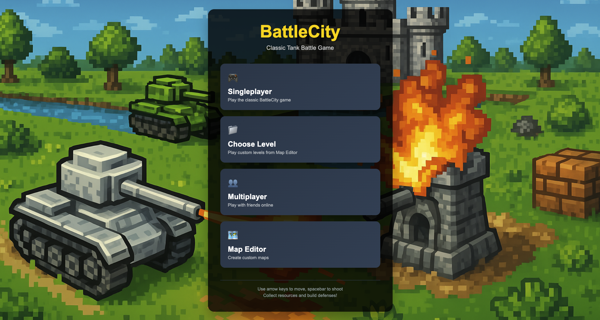
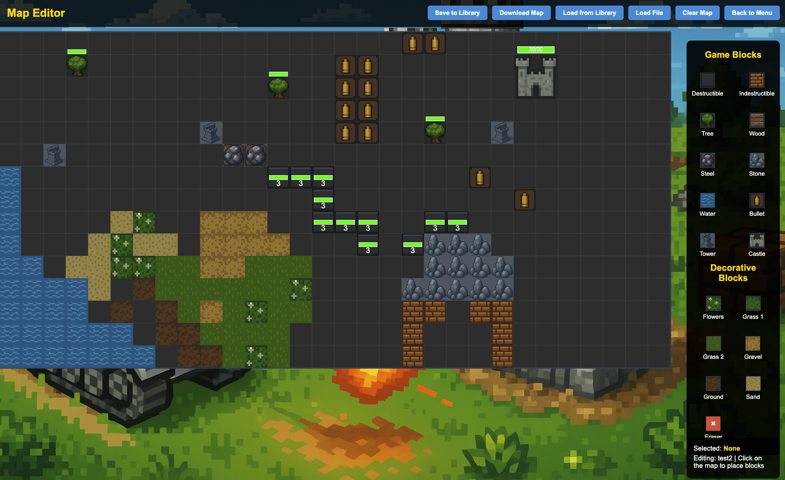

# BattleCity Game

A classic tank battle game with modern features including resource collection, tower defense, and a comprehensive menu system.

## How to Play

### Starting the Game
1. Open `menu.html` in your web browser
2. Choose from the three available options:
   - **Singleplayer**: Play the classic BattleCity game
   - **Multiplayer**: Coming soon - play with friends online
   - **Map Editor**: Coming soon - create custom maps

### Game Controls
- **Arrow Keys**: Move your tank
- **Spacebar**: Shoot bullets
- **Shop Button**: Open the shop to buy items
- **Menu Button**: Return to the main menu

### Game Features
- **Resource Collection**: Collect wood, steel, stones, and gold
- **Tower Defense**: Build shooting towers to defend against enemies
- **Enemy AI**: Enemies will chase and attack you
- **Block Destruction**: Destroy various types of blocks to collect resources

### Game Modes

#### Singleplayer
The main game mode featuring:
- Tank movement and combat
- Resource collection system
- Tower building and defense
- Enemy AI with collision detection
- Multiple block types with different properties

#### Multiplayer (Coming Soon)
- Online multiplayer functionality
- Real-time player vs player combat
- Shared game worlds

#### Map Editor
- Custom map creation
- Block placement tools
- Save and load custom maps

## File Structure
- `menu.html` - Main menu page
- `index.html` - Singleplayer game
- `menu.css` - Menu styling
- `style.css` - Game styling
- `menu.js` - Menu functionality
- `src/` - Game source code

## Running the Game
1. Start a local web server in the BattleCity directory
2. Navigate to `menu.html` in your browser
3. Select "Singleplayer" to start playing

Enjoy the game! 